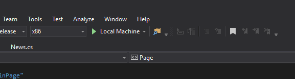
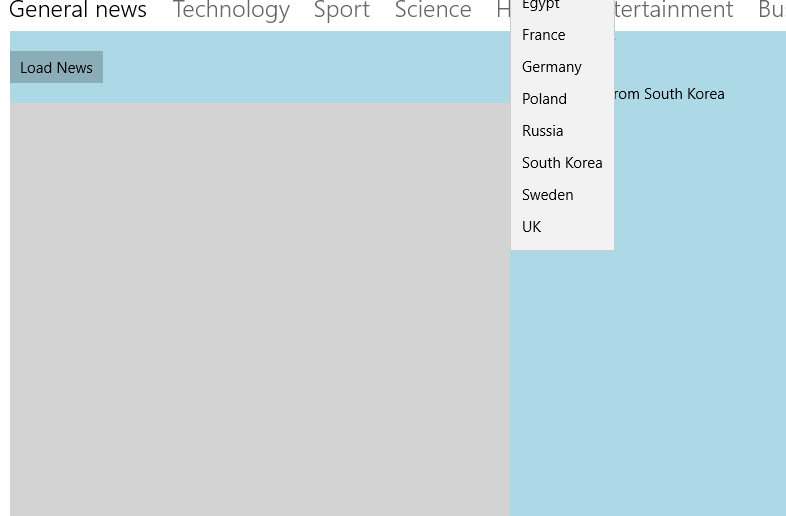

# NewsApp-UniversalWindows-

# E-News
Project for Mobile Application Development Module in 3rd year(2018). Creating a Universal Windows Application that connects to a public news API to pull data into JSON format to be then parsed and used in the application. Provided news from multiple countries and sources from around the world. 

## Getting Started:
Here I will show you how to downoad and start running this program from git hub.

### Prerequisites

In order to be able to successfully download and run this project you will need:
- A desktop computer/ a laptop
- Visual Studio 2017. You can find that here if you dont already have it -
```
https://www.visualstudio.com/downloads/
```

### Installation:

- To install this app onto your machine you must first navigate to where you want the program to be saved.
- Into your command prompt type -
```
git clone https://github.com/garyconnelly1/NewsApp-UniversalWindows-
```

### Running the application:
- Open up the application in visual studio 2017. 
- You then need to click the green arrow at the top of the screen - 



## Testing:
- You can test use the project by using the drop down box menu to select a country with which you would like to see news from - 



- You simply click on the load news button at the top of whatever pivot you happen to be on and wait for the news to appear.
- Once it has appeared you can click on a link under the article that redirects you to another page that shows you the full article from the actual source.


- You can see articles from any of the many pivots by clicking on the name of the category on the bar running along the top of the app.


