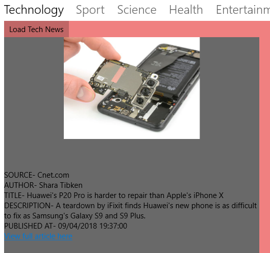

# NewsApp-UniversalWindows-
## Name: Gary Connelly.
## Student ID: G00336847
## Module: Mobile Applications Development 2.
## Lecturer: Damien Costello.

# E-News
Project for Mobile Application Development Module in 3rd year(2018). Creating a Universal Windows Application that connects to a public news API to pull data into JSON format to be then parsed and used in the application. Provided news from multiple countries and sources from around the world. 

## Getting Started:
Here I will show you how to downoad and start running this program from git hub.

### Prerequisites

In order to be able to successfully download and run this project you will need:
- A desktop computer/ a laptop
- Visual Studio 2017. You can find that here if you dont already have it -
```
https://www.visualstudio.com/downloads/
```

### Installation:

- To install this app onto your machine you must first navigate to where you want the program to be saved.
- Into your command prompt type -
```
git clone https://github.com/garyconnelly1/NewsApp-UniversalWindows-
```

### Running the application:
- Open up the application in visual studio 2017. 
- You then need to click the green arrow at the top of the screen - 


## Testing:
- You can test use the project by using the drop down box menu to select a country with which you would like to see news from - 


- You simply click on the load news button at the top of whatever pivot you happen to be on and wait for the news to appear.
- Once it has appeared you can click on a link under the article that redirects you to another page that shows you the full article from the actual source.


- You can see articles from any of the many pivots by clicking on the name of the category on the bar running along the top of the app.




## How it was made.
### Resources:
I used a combination of resources to put this project together, first and foremost was learnonline. The main criterea we had to hit in order to get a basic pass grade in this project was all well documented in our notes, along with clear examples of how to impliment them into our lab work, and later to the project. - https://learnonline.gmit.ie/course/view.php?id=4195 . After that however, it was mainly up to us to add whatever functionality we wanted in our project. I knew from an early stage in this module that I was going to try to use a public API in this project as it was something I have never used before, but knew it would be an important skill to posess. I started scouring the internet for apis such as weather apis or transport apis, but I found them to be quite boring and unimaginative. I decided I was going to use a news API for pulling data into my project because of its scalability, and its ability to incompass some of the more basic apis available to the public. In the end I used - https://newsapi.org/ . I used this API as it was extremely well documented with step by step instructions of how to use it and because of the fact that is is very dynamic. Any problems I had concerning uwp was dealt with by referring to the microsoft documentation for xaml and uwp - https://docs.microsoft.com/en-us/uwp/api/windows.ui.xaml.documents . Any other problems I was having after that was dealt with by referring to stackoverflow as any problems I was having, other developers experienced similar issues and had them solved. - https://stackoverflow.com/ . 

### Features:
The main feature of this app is that it can constantly and consistently update with live news from around the world. I have made use of the pivot feature that is available on uwp with xaml. This was used to divide the news app up into its different categories. On the load page, there is a dropdown menu that allows the user to choose from a selection of different countries for where they would like to see news from. Once the news is loaded the user can click on the link underneath each article which will take them to the actual news source which contains the full article they  are interested in. I have also made use of the local storage that is available with uwp. I use it to simply store the country with which the user selected to see news from, this means that when the user opens the app again on the same machine, it will remain loading news from the country they selected. I have also made use of the default sounds offered by the uwp platform. To hear this make sure that your volume is on, on whatever device you are using and then simply interact with the application.

### Bugs and limitations:
While there are no build time or runtime erros in this application, there are still a few things I would wish to improve on in the future. The fact that this project is so scalable means that there is always room for improvement, but unfortunately there is a deadline for this project that has to be hit, along with keeping on top of all of the other projects that have been given to us. One thing that I wish I had time to add would be more user input. I chose this API because I knew that the majority of it could be entered dynamically by the user, I only wish I had time to showcase this. There is the possibility, using this API that the user could enter the language they want the news to appear in, or the exact news source they wanted to see, or even to search for a news source based off of a date. It would have been very interesting to see how far I could take this but I definitely intend on adding more user friendly functionality to it in the future. One other area that I was not entirely happy with was that the area in which the articles actually appear is very minimised compared to the rest of the page. Now this can be easily changed but I designed it in that way because my origional plan was to have two or maybe even three different article feeds on each page running simultaniously. For example you could have Irish news in the center and maybe Uk and US news either side of it. This is also very possible using this API and I intend looking into it further upon completion of this college year.


## Final thoughts:
I thoroughly enjoyed making this app as I feel as though I learned a lot. There were times where I felt as though maybe using a news API was too complicated but I am glad I powered through it to get to the finished product. Not only did I gain a huge understanding about ther universal windows platform, but I even feel as though this project will benifit me greatly going forward in every module. I discovered, in this project more than any others, how to break a problem down into the smallest possible components to be able to solve a problem or task. I am delighted that I got the opportunity to work with an API and learn how the calls work because working with data will be a huge part of my career going forward.  

## Author:
Gary Connelly
